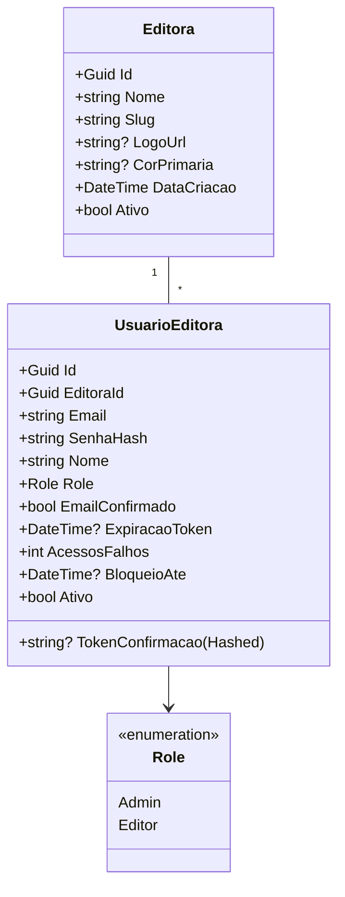
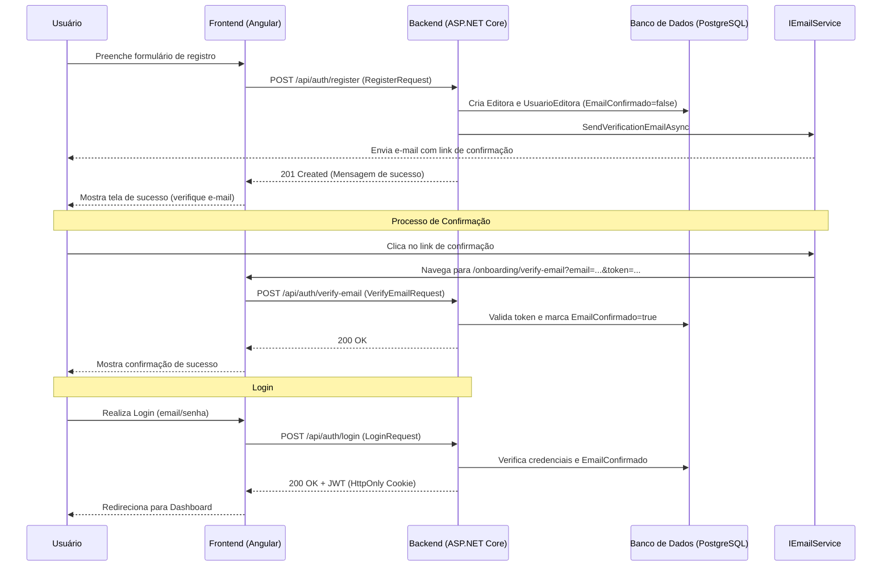
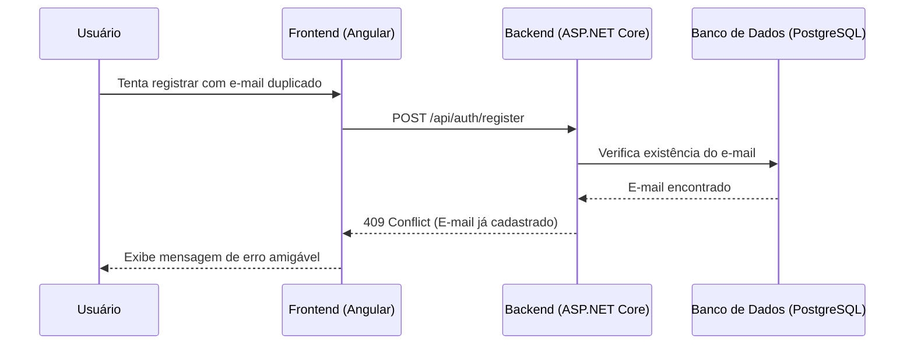
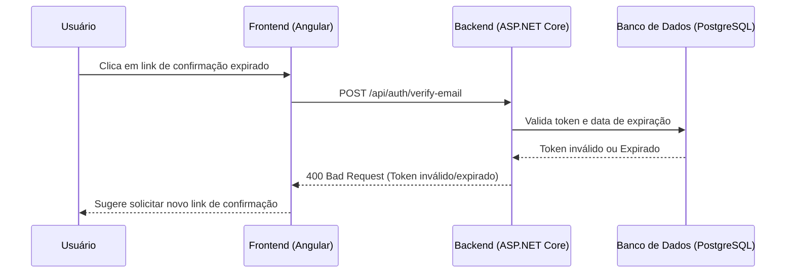

# Implementação do Onboarding

Este documento descreve a arquitetura e os fluxos do processo de onboarding da editora no SaaS Editorial.

## Diagrama de Classes

O diagrama abaixo ilustra as principais entidades envolvidas no processo de onboarding e o relacionamento entre elas.

## Fluxo de Registro e Confirmação de E-mail

O fluxo a seguir detalha as etapas desde o registro inicial da editora até o primeiro login bem-sucedido após a confirmação do e-mail.

## Fluxos Alternativos e Exceções

### E-mail já cadastrado
Se o administrador tentar registrar uma editora com um e-mail que já possui vínculo com outra editora (ou a mesma), o sistema retorna um conflito.

### Token de Confirmação Expirado ou Inválido
O token de confirmação possui validade de 24 horas. Se o usuário clicar em um link expirado, ele deve ser orientado a solicitar um novo e-mail.

## Endpoints de Autenticação

| Endpoint | Método | Descrição |
| :--- | :--- | :--- |
| `api/auth/register` | POST | Registra uma nova editora e o usuário administrador. |
| `api/auth/verify-email` | POST | Valida o token de confirmação enviado por e-mail. |
| `api/auth/login` | POST | Autentica o usuário e emite o token JWT. |
| `api/auth/logout` | POST | Remove o cookie de autenticação. |
