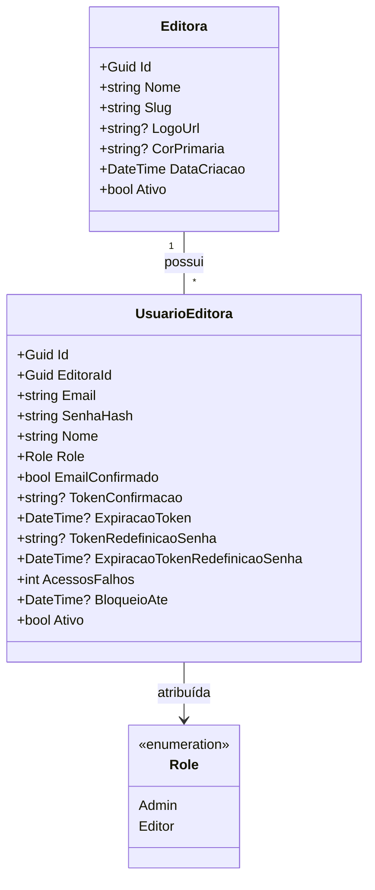
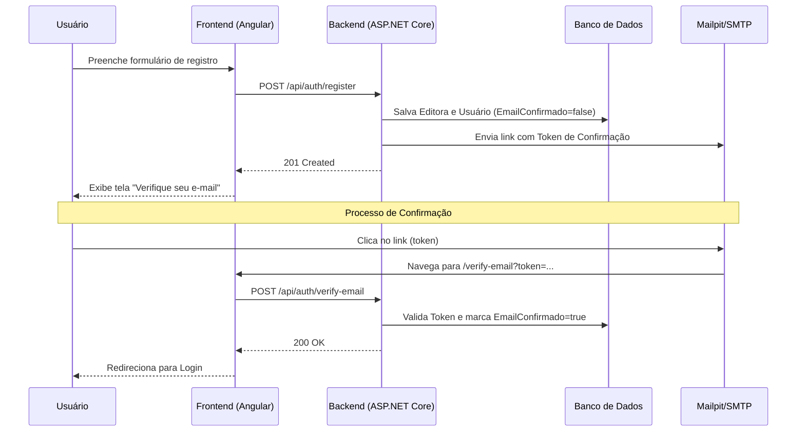
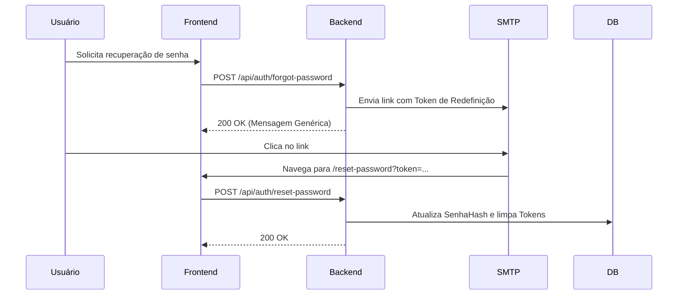

# Documentação Técnica: Onboarding de Editoras

Este documento detalha a arquitetura, os fluxos de dados e as especificações da API para o processo de onboarding de novas editoras no sistema SaaS Editorial.

---

## 1. Modelo de Dados (Diagrama de Classes)

O diagrama abaixo ilustra as entidades centrais e seus relacionamentos. O sistema utiliza uma arquitetura multi-tenant isolada por `EditoraId`.



---

## 2. Fluxos de Sequência

### 2.1. Registro e Verificação de E-mail (Fluxo Principal)
O registro cria a editora e o usuário administrador em estado inativo até a confirmação do e-mail.



### 2.2. Recuperação de Senha (Fluxo Alternativo)
Permite que o usuário redefina sua senha caso a tenha esquecido.



---

## 3. Fluxos de Exceção e Segurança

### 3.1. Bloqueio de Conta (Account Lockout)
Após 5 tentativas falhas consecutivas, a conta é bloqueada por 15 minutos para prevenir ataques de força bruta.

| Condição | Resposta do Sistema |
| :--- | :--- |
| **Tentativa 1-4 falha** | Retorna 401 Unauthorized e incrementa `AcessosFalhos`. |
| **Tentativa 5 falha** | Define `BloqueioAte` para 15 minutos no futuro. |
| **Tentativa durante bloqueio** | Retorna 423 Locked informando o tempo restante. |

### 3.2. Rate Limiting
A API de autenticação possui um limite global de **5 requisições por minuto por IP** para evitar abusos.
*   **Status Code:** `429 Too Many Requests`.

### 3.3. E-mail Duplicado
O sistema não permite o registro de uma editora se o e-mail do administrador já estiver em uso.
*   **Status Code:** `409 Conflict`.

---

## 4. Documentação da API (v1)

### POST `/api/auth/register`
Registra uma nova editora e seu primeiro administrador.

**Request Body:**
```json
{
  "nomeEditora": "Minha Editora",
  "emailAdmin": "admin@editora.com",
  "senha": "SenhaForte123!",
  "nomeAdmin": "João Silva"
}
```

**Responses:**
*   `201 Created`: Sucesso. Retorna `editoraId`.
*   `400 Bad Request`: Erro de validação (ex: senha fraca).
*   `409 Conflict`: E-mail já cadastrado.

---

### POST `/api/auth/login`
Autentica o usuário e define um **HttpOnly Cookie** chamado `access_token`.

**Request Body:**
```json
{
  "email": "admin@editora.com",
  "senha": "SenhaForte123!"
}
```

**Responses:**
*   `200 OK`: Sucesso. Retorna o token JWT e dados básicos do usuário.
*   `401 Unauthorized`: Credenciais inválidas ou e-mail não confirmado.
*   `423 Locked`: Conta temporariamente bloqueada.

---

### POST `/api/auth/verify-email`
Confirma a posse do e-mail através do token.

**Request Body:**
```json
{
  "email": "admin@editora.com",
  "token": "token_gerado_pela_api"
}
```

**Responses:**
*   `200 OK`: E-mail confirmado com sucesso.
*   `400 Bad Request`: Token inválido ou expirado.

---

### POST `/api/auth/reset-password`
Define uma nova senha utilizando o token de redefinição.

**Request Body:**
```json
{
  "email": "admin@editora.com",
  "token": "token_redefinicao",
  "novaSenha": "NovaSenhaForte123!"
}
```

**Responses:**
*   `200 OK`: Senha atualizada com sucesso.
*   `400 Bad Request`: Token inválido ou senha não atende aos requisitos.
